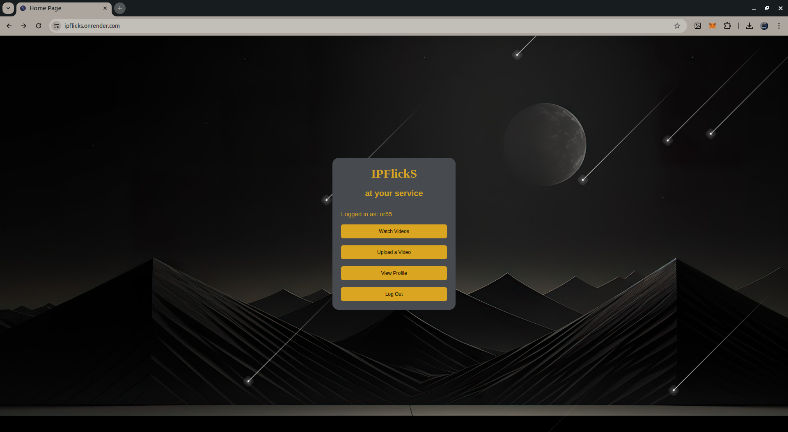
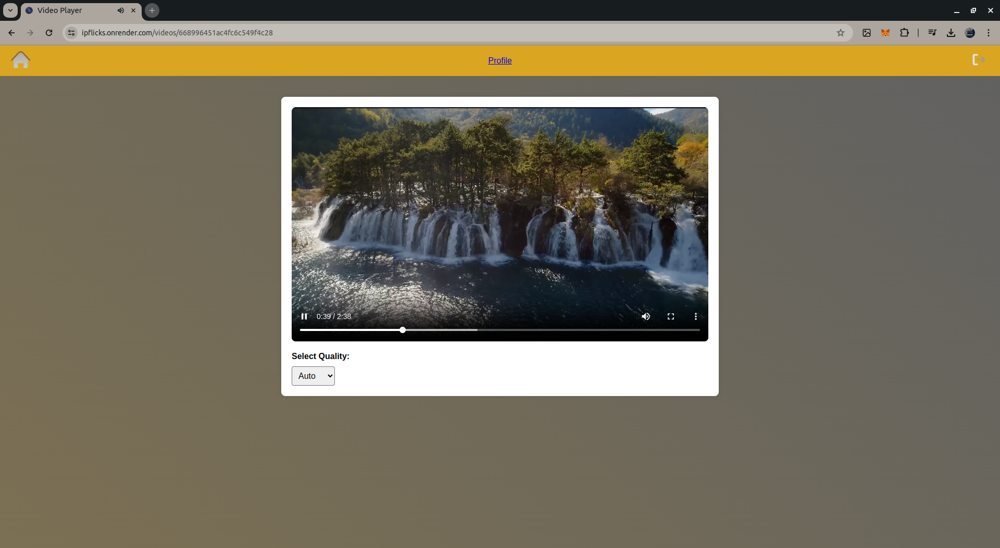
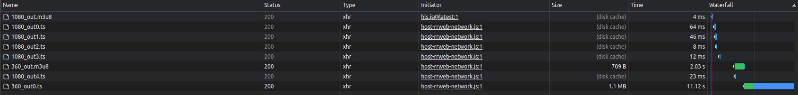

### Introduction to IPFlickS

**IPFlickS** is a video streaming service leveraging IPFS (InterPlanetary File System) to store and stream video content efficiently. The service implements adaptive bit-rate streaming to optimize video quality based on the viewer's current network conditions. This repository contains the server-side implementation using Node.js, Express, and MongoDB, with video processing handled by FFmpeg and IPFS integration facilitated by Pinata.

## Requirements

To clone and run this server, you will need the following installed on your machine:

1. **Node.js** (v14.x or higher)
2. **MongoDB** (v4.x or higher)
3. **FFmpeg** (for video processing)
4. **Pinata** account (for IPFS storage)

## Screenshots:
Home Screen


Video Player



Adaptive Bit Rate 



## Key Features

- **Adaptive Bit-Rate Streaming**: Adjusts video quality based on network conditions.
- **Video Chunking with FFmpeg**: Processes videos into 10-second chunks at various resolutions.
- **IPFS Storage via Pinata**: Stores video chunks on IPFS, reducing the need for extensive database storage.


## Instructions to Clone and Run the Server

1. **Clone the Repository**

    Open your terminal and clone the repository using git:
    ```sh
    git clone https://github.com/NR55/IPFS-Streaming.git
    cd IPFS-Streaming
    ```

2. **Install Dependencies**

    Install the necessary Node.js packages:
    ```sh
    npm install
    ```

3. **Set Up Environment Variables**

    Create a `.env` file in the root directory and add the following environment variables:
    ```sh
    MONGO_URI=<your_mongodb_connection_string>
    PINATA_API_KEY=<your_pinata_api_key>
    PINATA_SECRET_API_KEY=<your_pinata_secret_api_key>
    PINATA_JWT=<your_pinata_jwt_token>
    ```

4. **Start MongoDB**

    Ensure your MongoDB server is running. You can start it using:
    ```sh
    mongod
    ```

5. **Run the Server**

    Start the server by running:
    ```sh
    npm run startDev
    ```

    The server should now be running on `http://localhost:5000`.
